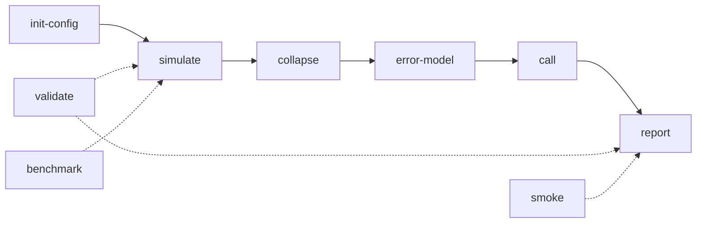

# CLI Reference

Precise MRD provides a comprehensive command-line interface for ctDNA/UMI analysis.

## Overview

```bash
precise-mrd --help
```

The CLI consists of several subcommands that can be run independently or as part of a complete pipeline:

| Command | Purpose | Input | Output |
|---------|---------|-------|--------|
| [`smoke`](smoke.md) | Fast end-to-end pipeline | Config (optional) | Complete results |
| [`simulate`](simulate.md) | Generate synthetic reads | Config | Read data |
| [`collapse`](collapse.md) | UMI consensus calling | Reads + config | Consensus data |
| [`error-model`](error-model.md) | Fit error model | Consensus + config | Error rates |
| [`call`](call.md) | Variant calling | Data + error model | Calls + LoD |
| [`report`](report.md) | Generate reports | Results | HTML/JSON reports |
| [`init-config`](init-config.md) | Create configuration | Template | YAML config |
| [`validate`](validate.md) | Validate results | Config + results | Validation report |
| [`benchmark`](benchmark.md) | Performance testing | Config | Timing results |

## Global Options

All commands support these global options:

### `--version`

Show version information and exit:

```bash
precise-mrd --version
# precise-mrd 0.1.0
```

### `--deterministic`

Show determinism configuration and exit:

```bash
precise-mrd --deterministic
```

```json
{
  "version": "0.1.0",
  "git_sha": "abc123...",
  "python_version": "3.11.x",
  "platform": "Darwin-22.6.0-arm64-arm-64bit",
  "deterministic_flags": {
    "PYTHONHASHSEED": "0 (recommended)",
    "numpy_random_state": "controlled via --seed",
    "pytorch_deterministic": "set if PyTorch available"
  }
}
```

## Common Patterns

### Machine-Readable Output

Add `--json` to most commands for structured output:

```bash
precise-mrd smoke --json > results.json
precise-mrd validate --json --config my_config.yaml
```

### Consistent Parameters

These parameters work across multiple commands:

- `--config PATH`: Configuration file (YAML)
- `--seed INT`: Random seed for reproducibility
- `--out PATH`: Output directory
- `--json`: JSON output format

### Pipeline Stages

Commands follow a logical progression:



## Quick Reference

### Complete Pipeline

```bash
# All-in-one
precise-mrd smoke --seed 42

# Step-by-step
precise-mrd init-config --output my_config.yaml
precise-mrd simulate --config my_config.yaml --seed 42
precise-mrd collapse --config my_config.yaml
precise-mrd error-model --config my_config.yaml
precise-mrd call --config my_config.yaml --seed 42
precise-mrd report --config my_config.yaml
```

### Quality Control

```bash
# Validate configuration and results
precise-mrd validate --config my_config.yaml --results artifacts/

# Performance benchmarking
precise-mrd benchmark --config my_config.yaml --n-runs 3

# Check determinism
precise-mrd smoke --seed 42  # Run twice, compare outputs
```

### Configuration Management

```bash
# Create configurations for different use cases
precise-mrd init-config --template small --output configs/ci.yaml
precise-mrd init-config --template default --output configs/research.yaml
precise-mrd init-config --template large --output configs/publication.yaml
```

## Command Details

Click on any command below for detailed documentation:

- **[smoke](smoke.md)** - Fast deterministic end-to-end pipeline
- **[simulate](simulate.md)** - Generate synthetic ctDNA reads with UMI families
- **[collapse](collapse.md)** - UMI consensus calling and family collapsing
- **[error-model](error-model.md)** - Fit trinucleotide context error models
- **[call](call.md)** - Statistical variant calling with LoD estimation
- **[report](report.md)** - Generate interactive HTML reports
- **[init-config](init-config.md)** - Initialize configuration files
- **[validate](validate.md)** - Validate pipeline configuration and results
- **[benchmark](benchmark.md)** - Performance benchmarking and timing

## Examples

### Research Workflow

```bash
# Set up analysis
precise-mrd init-config --template default --output configs/study.yaml

# Run analysis with multiple seeds
for seed in 42 123 456; do
  precise-mrd simulate --config configs/study.yaml --seed $seed --out results/seed_$seed
  precise-mrd collapse --config configs/study.yaml --out results/seed_$seed
  precise-mrd error-model --config configs/study.yaml --out results/seed_$seed
  precise-mrd call --config configs/study.yaml --seed $seed --out results/seed_$seed
  precise-mrd report --config configs/study.yaml --out results/seed_$seed
done

# Validate all results
for seed in 42 123 456; do
  precise-mrd validate --config configs/study.yaml --results results/seed_$seed
done
```

### CI/CD Integration

```bash
# Fast validation pipeline for CI
precise-mrd init-config --template small --output .ci/config.yaml
precise-mrd smoke --config .ci/config.yaml --json > .ci/results.json

# Check performance budget
precise-mrd benchmark --config .ci/config.yaml --json | jq '.passed_60s_budget'
```

### Parameter Exploration

```bash
# Test different UMI family size thresholds
for min_size in 3 5 7 10; do
  # Modify config programmatically
  python -c "
import yaml
with open('configs/base.yaml') as f:
    config = yaml.safe_load(f)
config['umi']['min_family_size'] = $min_size
config['run_id'] = f'min_size_{$min_size}'
with open('configs/min_size_${min_size}.yaml', 'w') as f:
    yaml.dump(config, f)
"
  
  # Run analysis
  precise-mrd smoke --config configs/min_size_${min_size}.yaml
done
```

## Integration

### Python Scripts

```python
import subprocess
import json

# Run command and capture JSON output
result = subprocess.run([
    'precise-mrd', 'smoke', '--seed', '42', '--json'
], capture_output=True, text=True)

data = json.loads(result.stdout)
print(f"ROC AUC: {data['metrics']['roc_auc']}")
```

### Snakemake

```python
# Snakefile
rule run_precise_mrd:
    input:
        config="configs/{sample}.yaml"
    output:
        metrics="results/{sample}/metrics.json",
        html="results/{sample}/auto_report.html"
    shell:
        "precise-mrd smoke --config {input.config} --out results/{wildcards.sample}"
```

### Docker

```bash
# Run in container
docker run --rm \
  -v $PWD/configs:/app/configs \
  -v $PWD/results:/app/results \
  ghcr.io/precise-mrd/precise-mrd:latest \
  precise-mrd smoke --config configs/analysis.yaml --out results
```

## Error Handling

Commands return appropriate exit codes:

- `0`: Success
- `1`: Configuration error
- `2`: Missing dependencies (files not found)
- `3`: Validation failure
- `4`: Performance budget exceeded

Check exit codes in scripts:

```bash
if precise-mrd validate --config my_config.yaml; then
  echo "Configuration valid"
else
  echo "Configuration invalid (exit code: $?)"
  exit 1
fi
```