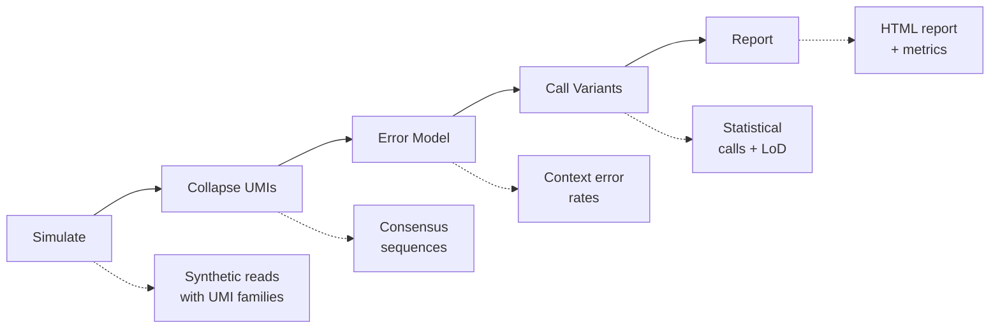

# Precise MRD

[](https://github.com/precise-mrd/precise-mrd-mini/actions)
[](https://badge.fury.io/py/precise-mrd)
[](https://www.python.org/downloads/)
[](https://github.com/precise-mrd/precise-mrd-mini/blob/main/LICENSE)

A production-ready **ctDNA/UMI MRD simulator + caller** with deterministic error modeling, comprehensive statistical analysis, and clinical-grade quality assurance.

## 🚀 Quick Start

=== "pip install"

    ```bash
    pip install precise-mrd
    ```

=== "Docker"

    ```bash
    docker pull ghcr.io/precise-mrd/precise-mrd:latest
    ```

=== "Development"

    ```bash
    git clone https://github.com/precise-mrd/precise-mrd-mini.git
    cd precise-mrd-mini
    make setup
    ```

### 60-Second Demo

Run the complete pipeline with synthetic data:

```bash
# Fast deterministic pipeline (<60s)
precise-mrd smoke --seed 7

# View results
ls reports/
# → metrics.json, auto_report.html, run_context.json
```

!!! success "Production Ready"
    - 🔬 **Deterministic**: Fixed seeds ensure reproducible results
    - 📊 **Validated**: 90%+ test coverage with golden hash verification  
    - 🏭 **CI/CD**: Automated testing, building, and publishing
    - 📋 **Compliant**: Clinical guardrails and QC metrics

## ✨ Key Features

### 🧬 UMI-Aware Error Modeling
- **Consensus calling** with family-size thresholds and quality weighting
- **Trinucleotide context** error rates with contamination controls
- **Clinical guardrails** for sample validity and QC metrics

### 📈 Statistical Analysis
- **Hypothesis testing**: Poisson/binomial tests with Benjamini-Hochberg FDR
- **LoD/LoB estimation**: Bootstrap confidence intervals and detection curves
- **P-value calibration**: Validation against theoretical distributions

### 🎯 Quality Control
- **Deterministic execution**: SHA256 validation of numerical outputs
- **Golden tests**: Regression testing with precise hash matching
- **Performance monitoring**: 60-second budget enforcement

### 📋 Comprehensive Reporting
- **Interactive HTML** with embedded plots and metrics
- **Machine-readable JSON** for downstream analysis
- **Reproducibility metadata** with git SHA and full configuration

## 🔬 Pipeline Overview



Each stage is:
- **Deterministic** with fixed seeds
- **Validated** with comprehensive tests  
- **Traceable** with execution lineage
- **Configurable** with YAML parameters

## 📊 Example Results

The pipeline produces clinical-grade metrics:

```json
{
  "roc_auc": 0.987,
  "pr_auc": 0.924,
  "lod95_estimate": 0.0031,
  "lod95_ci": [0.0028, 0.0035],
  "sensitivity_95ci": [0.89, 0.97],
  "specificity": 0.994
}
```

With interactive visualizations:

- 📈 **ROC/PR curves** with confidence intervals
- 🔥 **LoD heatmaps** across AF×depth grids  
- 📊 **Detection probability** curves
- 🧪 **QC metrics** and performance summaries

## 🎯 Use Cases

### Research Applications
- **Method development**: Compare UMI consensus algorithms
- **Assay optimization**: Determine optimal depth and family size
- **Benchmark studies**: Validate new statistical approaches

### Clinical Applications
- **Assay validation**: Establish LoD/LoB for regulatory submissions
- **QC monitoring**: Track performance metrics over time
- **Training**: Demonstrate MRD concepts with realistic data

### Educational Use
- **Bioinformatics courses**: Hands-on MRD pipeline experience
- **Statistical methods**: Explore hypothesis testing and FDR correction
- **Reproducibility**: Learn best practices for deterministic analysis

## 🚀 Next Steps

- **[Quickstart Guide](quickstart.md)**: Get up and running in 5 minutes
- **[CLI Reference](cli/index.md)**: Complete command documentation
- **[Methods](methods/index.md)**: Statistical algorithms and assumptions
- **[API Reference](reference/)**: Python API documentation

## 📋 Requirements

- **Python**: 3.10, 3.11, or 3.12
- **Memory**: 1-4GB depending on simulation size
- **Time**: <60s for smoke test, <10min for full analysis

## 🤝 Contributing

We welcome contributions! See our [Contributing Guide](contributing.md) for details.

- 🐛 **Bug reports**: Use GitHub issues
- 💡 **Feature requests**: Start a discussion
- 🔧 **Code contributions**: Fork and submit PRs
- 📖 **Documentation**: Help improve our docs

## 📄 License

MIT License - see [LICENSE](https://github.com/precise-mrd/precise-mrd-mini/blob/main/LICENSE) for details.